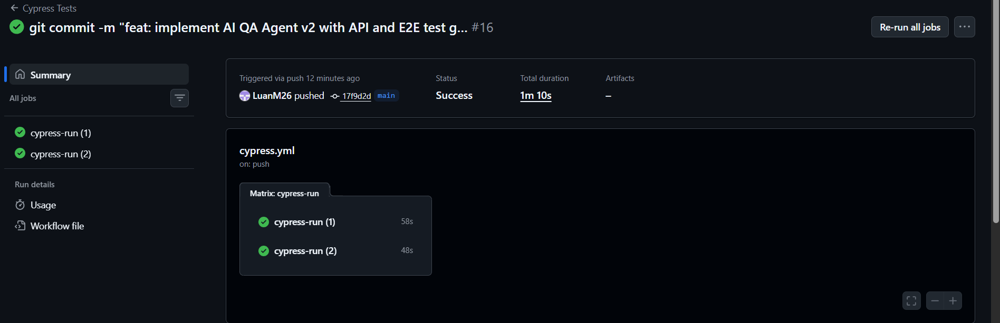
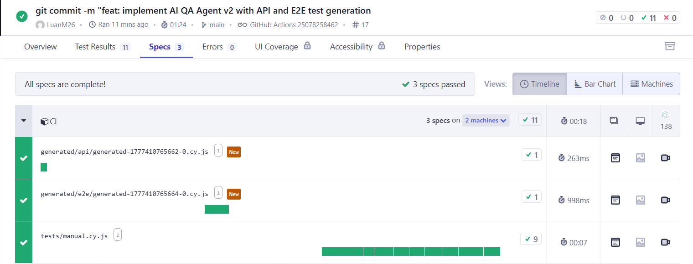
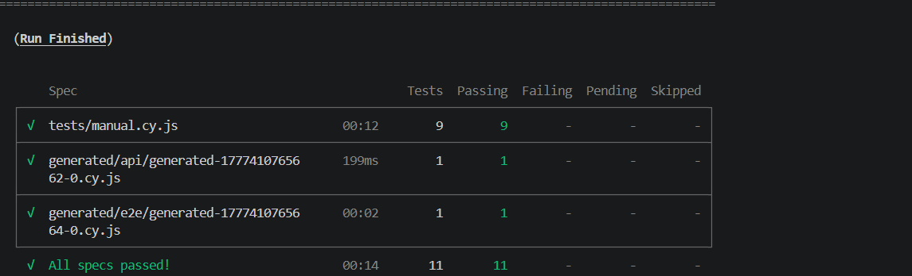

# 🤖 AI QA Agent V2


> 🚀 Um agente inteligente de QA que analisa cobertura, detecta gaps e gera testes automaticamente (API + E2E), integrando tudo em um pipeline CI/CD.

---

## 🧠 Problema

Em muitos projetos de QA:

* ❌ gaps de teste passam despercebidos
* ❌ testes são escritos manualmente
* ❌ cobertura real é desconhecida
* ❌ feedback é lento

---

## 💡 Solução

Este projeto implementa um **AI QA Agent** que:

* 🔍 Analisa testes existentes no Cypress
* 🧠 Detecta cenários não cobertos automaticamente
* 🧪 Gera testes de API e E2E
* 📊 Calcula um QA Score
* 🔁 Executa um ciclo contínuo de qualidade
* ⚙️ Integra tudo com CI/CD

---

## 🔁 QA Loop

```text
SAFE → detecta gaps → gera testes  
FULL → valida cobertura  
CYPRESS → executa todos os testes  
```

---

## 🔥 CI/CD em execução



✔ Execução automática
✔ Pipeline verde
✔ Execução paralela

---

## 🧪 Execução dos testes (Cypress)



✔ 3 specs executados
✔ 11 testes passando
✔ 0 falhas

---
## ⚙️ Execução headless

Os testes são executados em modo headless utilizando Cypress:

```bash
cypress run

---

## 📊 QA Report

### QA Score

**75%**

### Endpoint

* /search

### Cobertura

* ✅ success
* ✅ validation
* ✅ negative
* ❌ empty

### Gap detectado

* missing: empty input

---

## 🧠 Arquitetura

```text
ai-agent-v2/
  src/
    analysis/
    generation/
    report/
    types/
    core/

cypress/
  e2e/
    tests/
    generated/
      api/
      e2e/
```

---

## 🧪 Estratégia de Testes

### ✔ Manual

* Regras de negócio
* UI complexa

### ✔ API (gerado)

* Empty input
* Negative
* Validation

### ✔ E2E (gerado)

* Fluxos reais
* UI consistente

---

## ⚙️ Como rodar

```bash
npm install
npm run qa:safe
npm run qa:full
npm run cy:run
```

---

## 📈 Valor

QA tradicional:

```text
manual
lento
reativo
```

AI QA Agent:

```text
automático
rápido
inteligente
```

---

## 🚀 Roadmap

* Geração baseada em DOM
* Multi-endpoints
* IA para sugestão de testes
* Dashboard

---

## 🧑‍💻 Autor

**Luan Macedo**

---

## ⭐ Destaque

> Sistema de QA automatizado com geração de testes, análise de cobertura e validação contínua em CI/CD.
